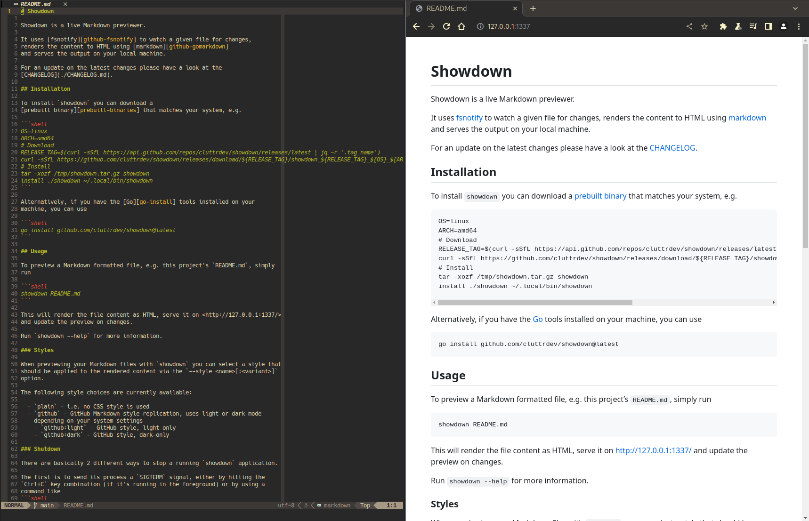

# Showdown



Showdown is a live Markdown previewer.

It uses [fsnotify][github-fsnotify] to watch a given file for changes,
renders the content to HTML using [markdown][github-gomarkdown]
and serves the output on your local machine.

For an update on the latest changes please have a look at the
[CHANGELOG](./CHANGELOG.md).

## Installation

To install `showdown` you can download a 
[prebuilt binary][prebuilt-binaries] that matches your system, e.g.

```shell
OS=linux
ARCH=amd64
# Download
RELEASE_TAG=$(curl -sSfL https://api.github.com/repos/cluttrdev/showdown/releases/latest | jq -r '.tag_name')
curl -sSfL https://github.com/cluttrdev/showdown/releases/download/${RELEASE_TAG}/showdown_${RELEASE_TAG}_${OS}_${ARCH}.tar.gz -o /tmp/showdown.tar.gz
# Install
tar -xozf /tmp/showdown.tar.gz showdown
install ./showdown ~/.local/bin/showdown
```

Alternatively, if you have the [Go][go-install] tools installed on your
machine, you can use

```shell
go install github.com/cluttrdev/showdown@latest
```

## Usage

To preview a Markdown formatted file, e.g. this project's `README.md`, simply
run

```shell
showdown README.md
```

This will render the file content as HTML, serve it on <http://127.0.0.1:1337/>
and update the preview on changes.

Run `showdown --help` for more information.

### Styles

When previewing your Markdown files with `showdown` you can select a style that
should be applied to the rendered content via the `--style <name>[:<variant>]` 
option.

The following style choices are currently available:

  - `plain` - i.e. no CSS style is used
  - `github` - GitHub Markdown style replication, uses light or dark mode
    depending on your system settings
    - `github:light` - GitHub style, light-only
    - `github:dark` - GitHub style, dark-only

### Shutdown

There are basically 2 different ways to stop a running `showdown` application.

The first is to send its process a `SIGINT` or `SIGTERM` signal, either by
hitting the `Ctrl+C` key combination (if it's running in the foreground) or by
using a command like
```shell
kill -s SIGTERM $(pidof showdown)
```

The second one is to send a http `POST` request to the application server's
`/shutdown` endpoint, e.g.
```shell
curl --request POST http://127.0.0.1:1337/shutdown
```
(There's also the `shutdown stop` command that does send this request for you.)

## Acknowledgements

This project was inspired by the [livedown][github-livedown] project of Hrvoje
Šimić.

The CSS stylesheets to replicate the GitHub Markdown styles were taken from 
Sindre Sorhus' [github-markdown-css][github-markdown-css] repo.

## License

This project is released under the [MIT License](./LICENSE)

## Troubleshooting

#### No live update when editing in (neo)vim

If you're previewing a file while editing it using (neo)vim it might not get
updated on writes. This is probably due to how backups are configured in your
setup (see `:help backup`).

> If you write to an existing file (but do not append) while the 'backup',
> 'writebackup' or 'patchmode' option is on, a backup of the original file is
> made. The file is either copied or renamed (see 'backupcopy').

If `backupcopy` is set to `"no"` (or `"auto"`) the original file is renamed and
a new one is written to. Thus, the backup file is checked for changes instead
of the newly created file.

To fix this, consider setting the `backupcopy` option to `"yes"`. This will
make a copy of the file and overwrite the original one.

<!-- Links -->
[github-fsnotify]: https://github.com/fsnotify/fsnotify
[github-gomarkdown]: https://github.com/gomarkdown/markdown
[github-livedown]: https://github.com/shime/livedown
[github-markdown-css]: https://github.com/sindresorhus/github-markdown-css
[go-install]: https://go.dev/doc/install
[prebuilt-binaries]: https://github.com/cluttrdev/showdown/releases/latest
